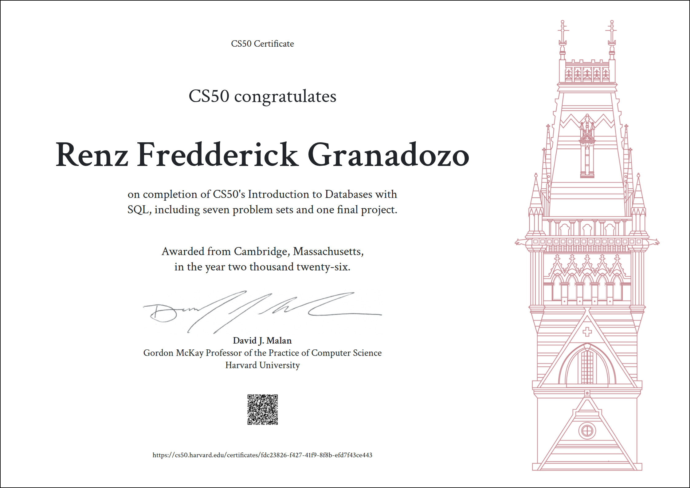
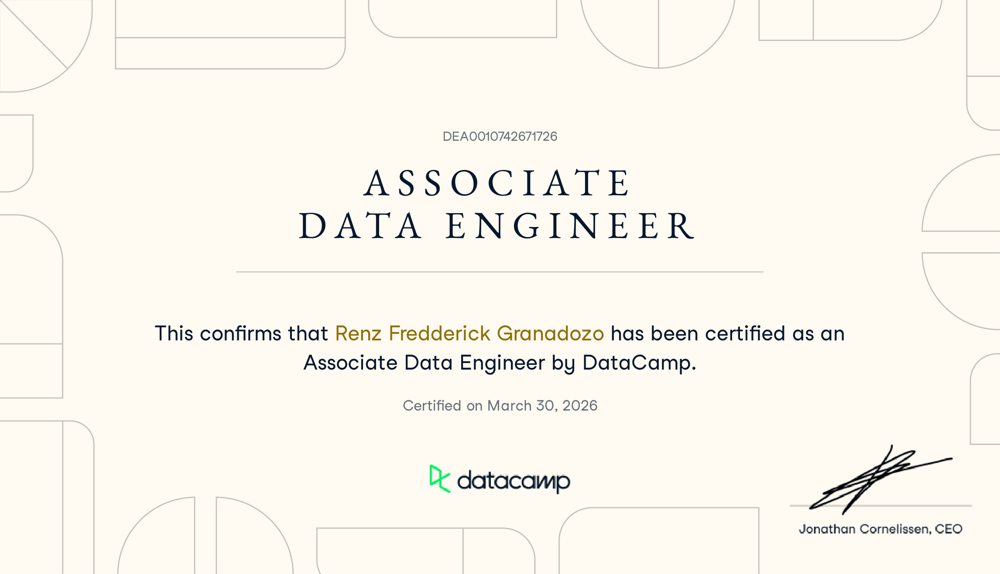
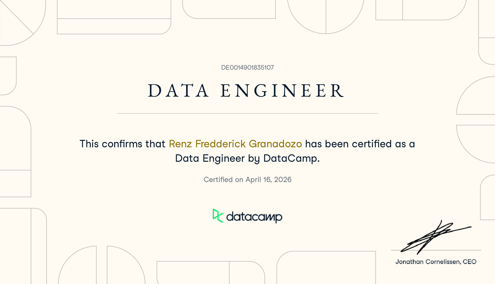

## 💫 About Me:
• Data Engineer with an Electronics Engineering background and hands-on experience designing scalable data pipelines, relational database architectures, and production-style ETL workflows. 

• Built an end-to-end fraud detection system using PostgreSQL and Python, implementing multi-layer schema design, feature engineering with advanced SQL, and performance optimization using materialized views. 

• Strong foundation in system architecture, data modeling, and integration engineering. 
 

## 🌐 Socials:
 
 

## 💻 Technical Skills:
### Systems and Languages
 
 
 
 
 
 

### Databases
 
 
 

### Tools 
 

### Web Development
 
 
 

 
 

### AI/ML
 
 
 
 
 
 
 
 
 

### Operational Systems
 
 

### Design
 
 
 
 

 

---

## 📈 GitHub Stats:

  

  

## ✍️ Quote of the Day!

  

## 🤖 Computer Science (CS50 Harvard)

Python • C • SQL • PostgreSQL • SQLite • Flask • Jinja2 • Bootstrap • Git • Linux • Bash • REST APIs • Data Structures & Algorithms

<table>
  <tr>
    <td align="center" width="25%">
      
       <b>Programming with Python</b>
       CS50 Harvard · Dec 2025
       
    </td>
    <td align="center" width="25%">
      
       <b>Computer Science</b>
       CS50 Harvard · Feb 2026
       
    </td>
    <td align="center" width="25%">
      
       <b>Databases with SQL </b>
       CS50 Harvard · Feb 2026
       
    </td>
    <td align="center" width="25%">
        
         <b>Cybersecurity</b>
         CS50 Harvard · April 2026
         
    </td>
  </tr>
  
    
  
</table>

## 🤖 DataCamp (Data Engineering Pilipinas Scholar)

Data Engineer • Data Scientist • Machine Learning • Artificial Intelligence

<table>
  <tr>
    <td align="center" width="25%">
      
       <b>Associate Data Engineer</b>
       DataCamp · March 2026
       
    </td>
    <td align="center" width="25%">
      
       <b>Data Engineer</b>
       DataCamp · April 2026
       
    </td>
</table>

